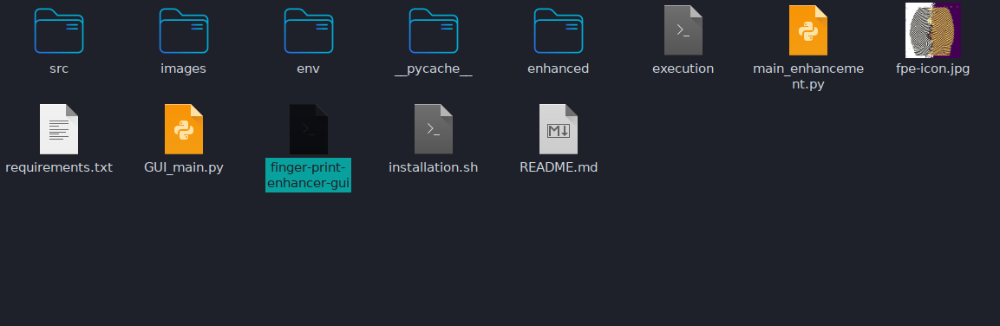
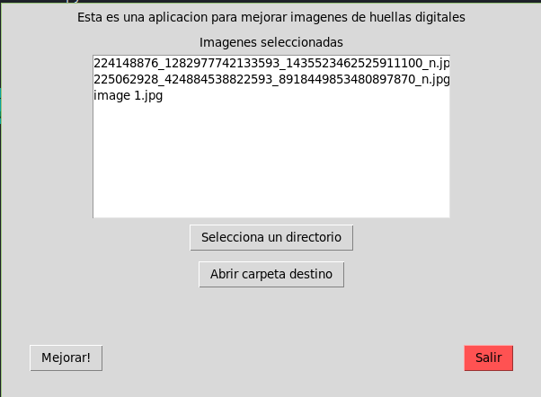

# Fingerprint-Enhancement-Python

Using oriented gabor filters to enhance fingerprint images based on https://github.com/ylevalle/Fingerprint-Enhancement-Python

this version is written in python3

# Usage: python main_enhancement.py

The images of the fingerprint for the enhancement must be in the "images" directory, the program will enhance all the images in that directory and they will be located in the "enhanced" directory with the same names and the suffix "_enhanced"

# Requirements
* [Python v3.9](https://www.python.org/downloads/release/python-398/)

## Installation of requirements

Execute installation.sh
```bash
./installation.sh
```

## Usage:
### Terminal
1. Copy your photos in png or jpg format to the images folder.
2. execute `execution` file:
```bash
./execution
```
Output:
```
Found 1 images in "images" folder
Processing images ...
Processing 1.jpg: (1/1)
	All enhanced images saved in the "enhanced" folder.
done.
```
Results:
```
enhanced
└── 1_enhanced.jpg

0 directories, 1 file
```
### GUI
1. Execute `finger-print-enhancer-gui` file:
```bash
./finger-print-enhancer-gui
```
or 
**Double click on this file**. Example:

this window will appear



# Requirements:

install [python](https://www.python.org/)

```r
numpy==1.21.2
opencv-python==4.5.3.56
scipy==1.7.1
```
Install it:
```sh
pip install -r requirements.txt
```
# Colaborators
* **Willy Samuel Paz Colque**
